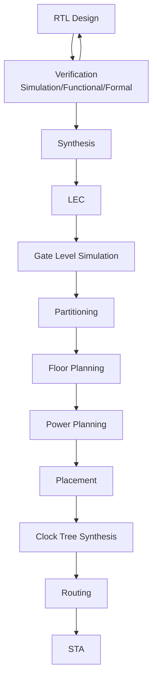

# RTL to GDS using open source EDA tools
## VLSI Design Flow

```mermaid
flowchart TD

%% Front End Design
A1[RTL Design]
A2[Verification<br/>Simulation/Functional/Formal]
A3[Synthesis]
A4[LEC]
A5[Gate Level Simulation]

A1 --> A2
A2 --> A3
A2 --> A1
A3 --> A4
A4 --> A5

%% Back End Design
B6[Partitioning]
B7[Floor Planning]
B8[Power Planning]
B9[Placement]
B10[Clock Tree Synthesis]
B11[Routing]
B12[STA]

A5 --> B6
B6 --> B7
B7 --> B8
B8 --> B9
B9 --> B10
B10 --> B11
B11 --> B12
```
